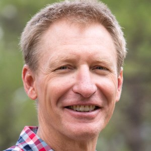

# Springer Ecohydrology & Hydrogeology Lab

*Understanding groundwater, karst, and springs across the Southwest.*

## 🧭 About

The **Springer Ecohydrology & Hydrogeology Lab** at **Northern Arizona University (NAU)** investigates the linkages between groundwater, surface water, and ecosystems in arid and semi-arid landscapes. Our research spans from the **Grand Canyon** to the **Mogollon Rim**, advancing understanding of how climate, geology, and land management affect water availability and ecosystem resilience.

### **Mission**

To improve understanding of **groundwater–surface water interactions**, **karst hydrogeology**, and **springs ecohydrology** through an integration of **field monitoring, geospatial analysis, and modeling** — supporting sustainable management of the Southwest’s most vital water resources.

### **Geographic Focus**

🗺️ The **Colorado Plateau and Grand Canyon region**, extending across northern Arizona and adjacent areas of the Southwest.

### **Core Research Themes**

-   💧 *Springs Ecohydrology*: Long-term monitoring and analysis of spring ecosystems in Grand Canyon National Park and surrounding landscapes.\
-   🌲 *Forest & Landscape Management Impacts on Recharge*: Evaluating how thinning, wildfire, and restoration affect infiltration and groundwater recharge.\
-   🧪 *Dye Tracing & Subsurface Connectivity*: Establishing a fluorescent dye tracing lab to characterize flow paths in karst aquifers and fractured volcanic terrains.\
-   🕳️ *Karst Landscape Characterization*: Mapping sinkholes, lineaments, and recharge features using high-resolution DEMs, LiDAR, and remote sensing.\
-   🌊 *Quantifying Base flow & Groundwater Contributions*: Combining hydrologic and isotopic approaches to separate groundwater inputs to springs and streams.

## 👩‍🔬 People

### **Principal Investigator**

{width="204"}

**Dr. Abe Springer**\
*Professor of Ecohydrogeology, School of Earth & Sustainability*\
Research interests: Karst hydrogeology, groundwater-surface water interactions, ecohydrology of springs, and sustainable water management in arid regions.\
- [NAU Faculty Page →](https://directory.nau.edu/person/aes9) - [Google Scholar](https://scholar.google.com/citations?hl=en&user=X53gmAQAAAAJ)

### **Current Members**

{width="203"}

-   **Ryan Lima, Ph.D.** – *Postdoctoral Scholar*\
    *Mapping and modeling landscape-scale groundwater recharge in Arizona’s karst terrains.*\

{width="191"}

-   **Caelum Mroczek** – *Ph.D. Candidate*\
    *Using AI/ML to quantify base flow and aquifer connectivity in arid regions.*

-   **Cecily Combs** – *M.S. Environmental Science & Policy*\
    *\*[update text]\**

-   **Hailey Galit** – *M.S. Geology*\
    *\*[update text]\**

-   **Matthew Miller** – *M.S. Environmental Science & Policy*\
    *\*[update text]\**

-   **Liam Houlgate** – *M.S. Environmental Science & Policy*\
    *\*[update text]\**

### **Lab Alumni**

-   **Aidan Houlgate**, M.S. 2025 - Now with [*update text*]
-   **Quentin McCalla**, M.S. 2025 - Now with [*update text*]
-   **Georgia Roberts**, Ph.D. 2025 - Assistant Teaching Professor, NAU
-   **Cole Denver**, M.S. 2024 - Now with Montana Bureau of Mines & Geology
-   **Isaiah Meza**, M.S. 2024 - Now with [*update text*]
-   **Katelyn LaPine**, M.S. 2023 - Now with [*update text*]
-   **Sarah Zurkee**, M.S. 2023 - Now with [*update text*]
-   **Andrew Lewis**, M.S. 2023 - Ph.D. Candidate at University of Hawai‘i at Mānoa

## Projects

------------------------------------------------------------------------

## 📊 Datasets

## Recent Publications

## Collaborations & Facilities

### Partners

-   City of Flagstaff
-   Coconino National Forest
-   Kaibab National Forest
-   Grand Canyon National Park
-   Arizona Department of Water Resources
-   Arizona Tri-University Recharge Project
-   Remote Sensing and Geoinformatics Lab at NAU

### **Facilities**

-   *Fluorescent Dye Tracing Lab (In Development)* – for subsurface flow and connectivity studies.
-   *Hydrogeochemistry Laboratory* – water quality, isotopic, and tracer analysis.

## Tools and Software

## Contacts & Links

[Dr. Springer's Profile at NAU SES](https://ses-nau.org/faculty-profiles/abraham-springer/)

For further information, please contact: Abe.Springer\@nau.edu
